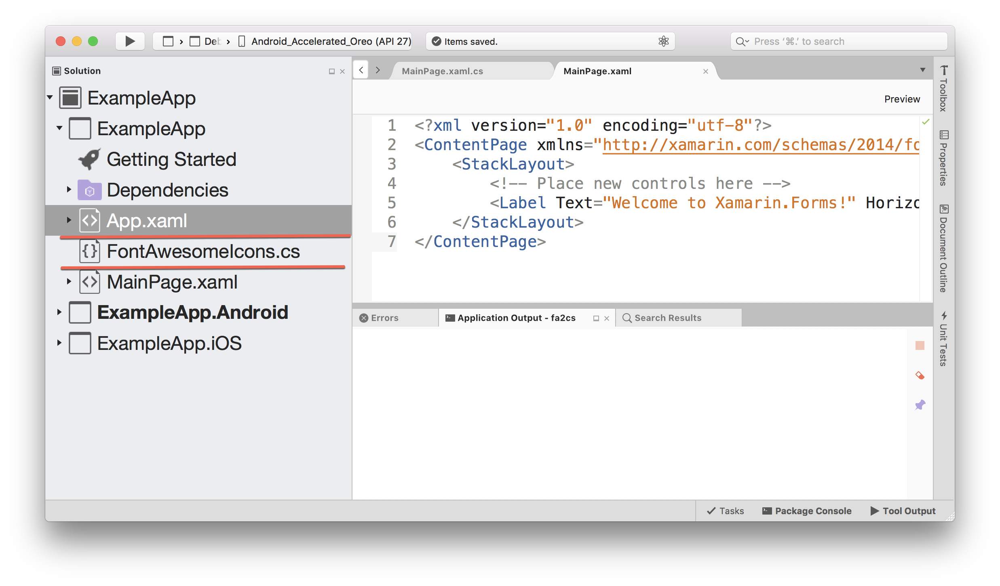

# About

FontAwesome To C# creates a C# file that contains string constants for all FontAwesome icon codes.

**[Get FontAwesomeIcons.cs here](FontAwesomeIcons.cs)**

# Now Available In MFractor

[MFractor](https://www.mfractor.com/), a productivity tool for Visual Studio Windows and Mac, can now generate a font glyph helper classes using any font asset.

[To learn more, please see our documentation on generating a glyph helper class for font assets.](https://docs.mfractor.com/fonts/generate-font-character-code-class/)

# Benefits

Use FontAwesome To C# to replace confusing and arcane unicode strings with a clean and descriptive property.

This:

```
submitButton.Text = "/uf00c"; // Huh? What icon is this? What font is it from? 😭
```

Becomes this:

```
submitButton.Text = FontAwesome.FontAwesomeIcons.Check; // Obviously a check icon from FontAwesome! 😊👍
```

The end result is cleaner, more readable and more maintainable code.

# Using FontAwesome To C#

It's super easy to use FontAwesome To C#.

Simply download [FontAwesomeIcons.cs](FontAwesomeIcons.cs) and place it into your project:



**Ensure that you have added the FontAwesome font files into your projects!**

You can use an icon in C# like:

```
var fileIcon = FontAwesome.FontAwesomeIcons.Alicorn;
```

You can use an icon in XAML by:

 * Adding a namespace reference to `FontAwesome`: `xmlns:fontAwesome="clr-namespace:FontAwesome"`;
 * Referencing a icon using `x:Static`: `<Label Text="{x:Static fontAwesome:FontAwesomeIcons.Alicorn}"/>`

Voila! All done!

# Credits

 * [Font Awesome](https://fontawesome.com/): The amazing Font Awesome icon set.
 * [HtmlAgility Pack](https://html-agility-pack.net/): Used for crawling www.fontawesome.com 🙈
 * [QuickType](https://quicktype.io/): Used to generate a C# model to consume https://fontawesome.com/cheatsheet.
 * [Assembly Emitter](https://josephwoodward.co.uk/2016/12/in-memory-c-sharp-compilation-using-roslyn): Used to emit the FontAwesome.IconCodes assembly.
